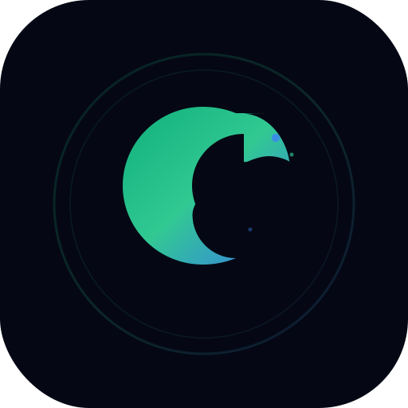

# Lamim — Complete Islamic Lifestyle PWA (v4.1.0)

Lamim is a premium, fully responsive, **offline-first** Islamic lifestyle dashboard. Built with a Vanilla JS frontend and powered by a high-performance IndexedDB cache engine, it provides a comprehensive suite of tools for daily prayers, dhikr, goal tracking, habit forging, and local financial ledger tracking—all running locally with zero external network dependencies for complete privacy and instant responsiveness.

## 🚀 Key Features

* **IndexedDB-Backed Sync Cache**: Your data is stored locally in IndexedDB to bypass the 5MB browser storage limit, utilizing a synchronous memory cache in RAM for 0ms read times and non-blocking background writes.
* **Auto-Backup Reminder**: A premium, non-intrusive 30-day reminder system that prompts you to download a backup file (`.json`) of your progress, protecting you from data loss if your browser cache is cleared.
* **Dynamic Script Lazy Loading**: External libraries like **Chart.js** (for Finance) and **html2pdf.js** (for Analysis Reports) are loaded dynamically on-demand only when needed, reducing initial page load time by over 40%.
* **Smart Finance Ledger**: Track income and expenses across 220+ master categories. Includes dynamic monthly summaries, visual transaction timelines, and auto-generated PDF Statement exports.
* **Savings Vaults**: Create goal-based savings vaults with high-contrast, percentage-based visual progression bars and dynamic milestones.
* **Salah (Prayer) Tracker**: 
    * Live countdown to the next prayer using sun-angle math calculated locally.
    * A 3-week interactive heatmap with tiered, glassmorphic visual feedback.
* **Dhikr (Tasbeeh) Counter**: Premium glowing tap button with ripple animations, tap sound, haptic vibration, and streak tracking.
* **Mujahid (Habit Forge)**: A robust module for tracking habits, logging relapses, earning progression badges, and guided breathing exercises (4-7-8 breathing technique) to combat urges.
* **Nafl Salah (Optional Prayers)**: Track Sunnah Muakkadah, Tahajjud, and Witr with a custom 3 AM "Waking Day" boundary logic.

## 🔒 Complete Local Privacy & Security
* **100% Offline-First**: All authentication, settings, and progress data are kept on your device. No cloud sync, no tracking, and zero data leakage.
* **XSS Fortified**: Every piece of user-generated content is strictly sanitized via a global HTML escaper before rendering to the DOM.
* **Typo & Strength Validation**: Built-in validation check systems for user setup profiles, bio bounds, and image sizes.

## 🎨 Design System (Premium Glassmorphism)

The application features a "State-of-the-Art Dark Glassmorphic" aesthetic:
* **Glassmorphism**: Extensive use of `backdrop-filter: blur(20px)` to create a frosted glass effect on cards, modals, sidebars, and banners.
* **Micro-Animations**: Custom CSS animations (`fadeInUp`, pulse, gradient shifts) ensure the UI feels alive.
* **Responsive**: Fluid CSS Grid and Flexbox logic guarantees flawless rendering across Mobile, Tablet, and Desktop.

## 🛠 Tech Stack

* **Frontend**: Pure Vanilla HTML5, CSS3, ES6+ JavaScript. No bundlers (Vite/Webpack) required.
* **Database Layer**: IndexedDB Engine (`lamim_db`) with `localStorage` fallback for legacy systems.
* **PWA**: Custom Service Worker (`sw.js`) with a `Network-First` (1.5s timeout) caching strategy and a scalable Web App Manifest.

---

## 📖 Developer Documentation
For an in-depth look at the internal APIs, module structures, and lifecycle workflows, please read the [DOCUMENTATION.md](DOCUMENTATION.md).

*Created and maintained with ❤️ for the Ummah.*
